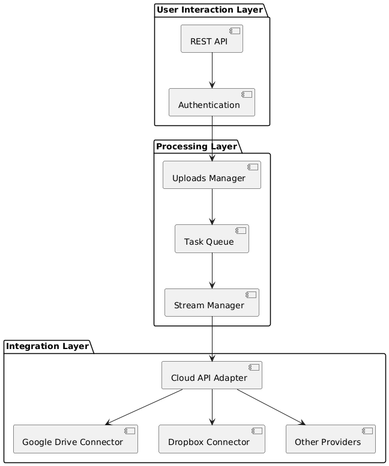

# File Uploader App Design

## Architecture Design

The system is designed with a modular and extensible architecture to support file uploads (via URLs, torrents/magnet links) and integration with multiple cloud storage providers.

### Component Diagram

### Components

- **REST API**: Provides endpoints for all app functionalities.
- **Authentication**: Authentication and authorization managed with Auth0 and Passport.
- **Cloud Providers**: Manages cloud providers and their connections.
- **Stream Manager**: Streams files directly to cloud providers without server storage.
- **Task Queue**: Manages upload/download tasks efficiently.
- **Cloud API Adapter**: Abstracts cloud storage interactions for Google Drive, Dropbox, and other providers.
- **Uploads Manager**: Manages uploads and their statuses.

---

## API Design

### Authentication

1. **GET** `/auth/me`: Get the current user.

### File Upload Operations

1. **POST** `/uploads/url`: Stream a file from a URL to a cloud provider.
2. **POST** `/uploads/torrent`: Process a torrent/magnet link and stream it to a cloud provider.
3. **GET** `/uploads/{upload_id}`: Get the status of a specific upload.
4. **GET** `/uploads`: List all uploads for the user.

### Task Management

1. **GET** `/tasks/{task_id}`: Get the status of a specific task.
2. **GET** `/tasks`: List all tasks for the user.

### Storage Provider Management

1. **GET** `/storage/providers`: List available storage providers.
2. **GET** `/storage/{provider}/connect`: Get OAuth URL for a storage provider.
3. **GET** `/storage/{provider}/callback`: Handle OAuth callback.
4. **GET** `/storage/{provider}/files`: List files in a storage provider.

---

## Storage Provider Design

### Google Drive

1. **GET** `/storage/providers/GOOGLE_DRIVE/connect`: Get OAuth URL for Google Drive.
2. **GET** `/storage/providers/GOOGLE_DRIVE/callback`: Handle OAuth callback.
3. **GET** `/storage/providers/GOOGLE_DRIVE/files`: List files in Google Drive.
